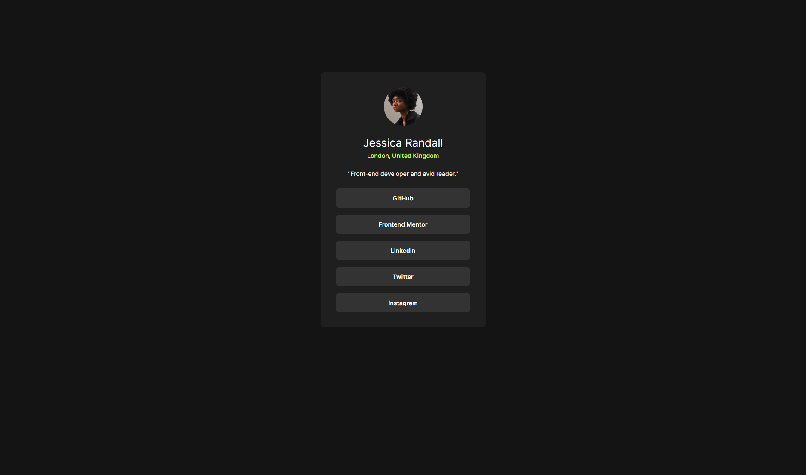

# Frontend Mentor - Social links profile solution

[![Status][shield-link]][complete-link] 

[shield-link]: https://img.shields.io/badge/STATUS-COMPLETE-00ff55
[complete-link]:  https://www.frontendmentor.io/solutions/social-links-profile-solution-vite-react-T9PmDRcpq4

[![Front end mentor link][shield-link2]][my-link2] [![Github Link][shield-link3]][my-link3]

[shield-link2]: https://img.shields.io/badge/_Profile-EJ--STONIEEEEE-6abecd?style=for-the-badge&logo=frontendmentor&logoColor=6abecd
[my-link2]: https://www.frontendmentor.io/profile/Stonieeeee
[shield-link3]: https://img.shields.io/badge/_Github-EJ--STONIEEEEE-adbac7?style=for-the-badge&logo=github&logoColor=adbac7
[my-link3]: https://github.com/Stonieeeee

This is a solution to the [Social links profile coding challenge on Frontend Mentor](https://www.frontendmentor.io/challenges/social-links-profile-UG32l9m6dQ).  Frontend Mentor challenges help you improve your coding skills by building realistic projects.

## Table of contents 📌

- [Frontend Mentor - Social links profile solution](#frontend-mentor---social-links-profile-solution)
  - [Table of contents 📌](#table-of-contents-)
  - [The challenge 🧗‍♂️](#the-challenge-️)
    - [Link 🔗](#link-)
    - [Screenshot 📸](#screenshot-)
  - [My Process](#my-process)
    - [Built with 🔨](#built-with-)
  - [Author ✍️](#author-️)
    - [Social Links 🌐](#social-links-)

## The challenge 🧗‍♂️

**Users should be able to:**

- View the optimal layout for the app depending on their device's screen size
- See hover states for all interactive elements on the page

### Link 🔗

- <a href="https://www.frontendmentor.io/solutions/social-links-profile-solution-vite-react-T9PmDRcpq4" target="_blank">Solution (Frontend Mentor)</a>
- <a href="https://stonieeeee.github.io/social-link-profile-solution/" target="_blank">Live Site (Github)</a>

### Screenshot 📸

 

 **This is a screenshot from my solution.** 

## My Process

### Built with 🔨

<!-- Bagdes -->

[![HTML5][design-link]][html-link] [![JavaScript][design-link2]][js-link] [![React][design-link4]][react-link] [![Git][design-link3]][git-link]

<!-- Badges-links -->

[design-link]: https://img.shields.io/badge/HTML5-E34F26?style=for-the-badge&logo=html5&logoColor=white

[html-link]: https://developer.mozilla.org/en-US/docs/Glossary/HTML5

[design-link2]: https://img.shields.io/badge/javascript-%23323330.svg?style=for-the-badge&logo=javascript&logoColor=%23F7DF1E

[js-link]: https://developer.mozilla.org/en-US/docs/Web/JavaScript

[design-link3]: https://img.shields.io/badge/Git-F05032?style=for-the-badge&logo=git&logoColor=white

[git-link]: https://git-scm.com

[design-link4]: https://img.shields.io/badge/react-%2320232a.svg?style=for-the-badge&logo=react&logoColor=%2361DAFB

[react-link]: https://react.dev

- React.js Library
- Flexbox Layout

## Author ✍️

### Social Links 🌐
- Frontend Mentor - <a href="https://www.frontendmentor.io/profile/Stonieeeee" target="_blank">Stonieeeee</a>
- Github - <a href="https://github.com/Stonieeeee" target="_blank">Stonieeeee</a>
- Facebook - <a href="https://www.facebook.com/ej.parducho" target="_blank">EJ Oliveros Parducho</a>

**Have fun building!** 🚀

